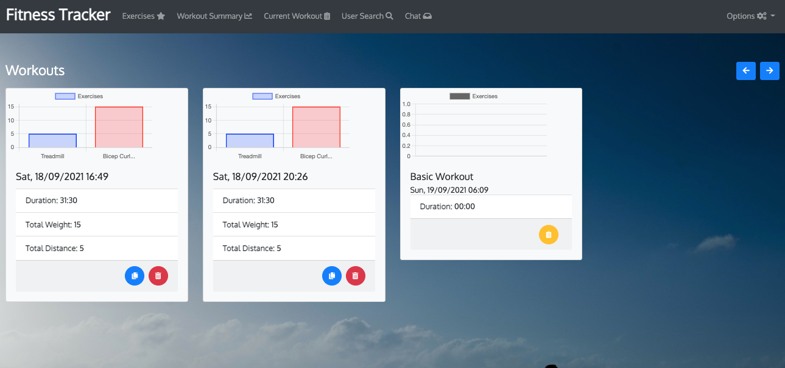
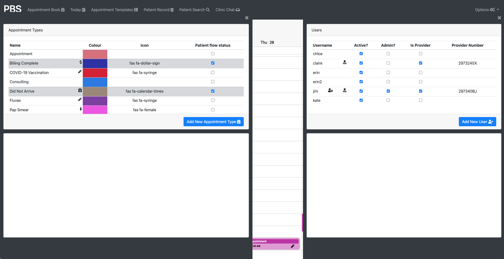

# Patient Booking System    [](https://opensource.org/licenses/MIT)

# Table of Contents

- [Project Description](#project-description)
- [Installation Instructions](#installation-instructions)
- [Configuration Variables](#configuration-variables)
- [User Story](#user-story)
- [Screenshot](#screenshot)
- [How To Contribute](#how-to-contribute)
- [Technology](#technology)
- [Presentation](#presentation)
- [Questions](#questions)
- [License](#license)

# Project Description

This [web application](https://pbs-jps.herokuapp.com/) allows the user to manage appointments for a medical practice.

The user is presented with:

1. The ability to view and create/modify/delete appointments for each active provider.
2. Chat with other users of the system to discuss patient issues.
3. Update their password.
4. View and update patient demographic details.

An admin user can further:

1.  Update other users, changing their privileges and/or resetting their password and current status
2.  Update appointment types, choosing the types color and/or icon classes
3.  Update the appointment "templates", automatic regularly scheduled appointment types per provider

As a technical note, the chat sessions are persisted and offline messages are received on login.

If the user is idle, the session expires in 24 hours.

# Installation Instructions

1. Install [node.js](http://nodejs.org)
2. Using the installed Node Package Manager `npm`, execute `npm install`  in the `frontend` directory, and again in
   the `backend` directory.
3. In the `frontend` directory, execute `npm run build.prod`, to build the webpacks for the backend `public/js`
   directory.
4. In the `backend` directory, execute `npm run build`, to build the `.js` files from the Typescript, which are compiled
   to the `dist` directory.
5. Configure the `.env` file with the specifics of your database, configuration files, and other parameters (message
   queue persistence, room timeouts):

# Configuration Variables

`API_SERVER_URL` - URL of the server completing the API calls (default `blank`)

`DB_URL` - address and access to the Mongo server machine

`DEBUG` - activate debug output (sub-options are space separated names (e.g. `server socket db api route message-queue`)

`MODE` - `Production`

`ENABLE_SOCKETS` - data synchronisation and chat subsystem, set to `Y`

`MQ_FILE` - Location of the offline message queue storage file (default `./db/queue.json`)

`MQ_INTERVAL` - Milliseconds between queue persistence (default `10000` - 10 seconds)

`SM_EXPIRY_CHAT` - number of minutes to keep a chat room persisted with no activity (default `43200` - 30 days)

`VIEW_RELATIVE_PATH` - location of the handlebars files in production, should be set to `/../../`

`DEMO_MODE` - obfuscate the patient demographics for demonstration purposes, should be `N` in normal use.

`QL-SCHEMA` - graph QL schema definition, set to `./config/schema.graphql`

# User Story

```
As a USER I want to be able to keep track of the appointments for the providers in my system, and once logged into the site
THEN I can view the appointment book, navigate to different dates, and filter by the providers
THEN I can view a patients demographics and update them as necessary
As a USER I want to be able to create chat to other users of the system if I have queries about my work or queries about patients
THEN I want to be able to set a priority on the message and optionally attach a patient


As an ADMIN USER I want to be able to manage other users of the system
THEN I can create and update users, setting their privileges, provider details, and optionally reset their password
As an ADMIN USER I want to be to manage the the types of appointments available
THEN I can edit each tyep of appointment, setting a view colour and optional icon
As an ADMIN USER I want to be able to manage the "appointment templates"
THEN I can view what regular appointments and their types for each provider are set in the system and modify them

As a PROVIDER when I log in I want to view my appointments for today and load the patient records for those appointments
THEN I want to be able to view each open patient and modify details as needed
```

# Screenshot



## How to contribute

Please access the [Questions](#questions) section to send me an email, or access the repository link if you wish to help
contribute to this project.

# Technology

1. [Node.js](http://nodejs.org)
2. NPM
4. [Moment](https://npmjs.com/package/moment)
5. [React](https://www.npmjs.com/package/react)
6. [BCrypt](https://www.npmjs.com/package/bcrypt)
7. [Bootstrap](https://getbootstrap.com/)
8. [Webpack](https://www.typescriptlang.org/)
9. [Babel](https://babeljs.io/)
10. [MongoDB](https://www.mongodb.com/)
11. [Mongoose](https://mongoosejs.com/docs/)
12. [DotENV](https://www.npmjs.com/package/dotenv)
13. [Git-Crypt](https://github.com/AGWA/git-crypt)
14. [Express](https://www.npmjs.com/package/express)
15. [Passport](https://www.npmjs.com/package/passport)
16. [Socket.io](https://socket.io/)
17. [Typescript](https://www.typescriptlang.org/)
18. [ts-node](https://github.com/TypeStrong/ts-node)
19. [tsc-watch](https://www.npmjs.com/package/tsc-watch)
20. [ts-loader](https://github.com/TypeStrong/ts-loader)
21. [Bootstrap 4 Round Buttons](https://www.geeksforgeeks.org/how-to-get-circular-buttons-in-bootstrap-4/)
22. [Mobiscroll](https://mobiscroll.com/)


# Questions

> **Direct your questions about this project to:**
>
>  *GitHub:* [Github Project Link](https://github.com/jsharples777/patient-booking-system)
>
>  *Email:* [jamie.sharples@gmail.com](mailto:jamie.sharples@gmail.com)

# License

### [MIT License](https://opensource.org/licenses/MIT)

A short and simple permissive license with conditions only requiring preservation of copyright and license notices.
Licensed works, modifications, and larger works may be distributed under different terms and without source code.
